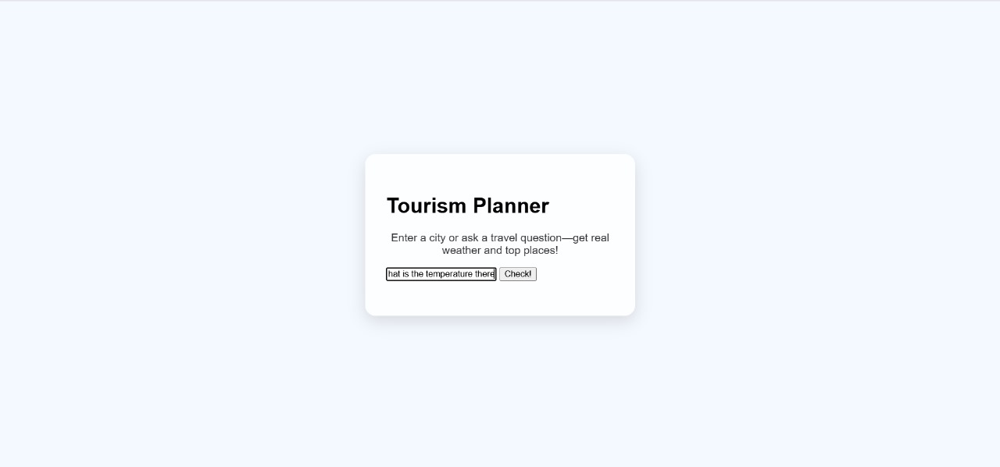
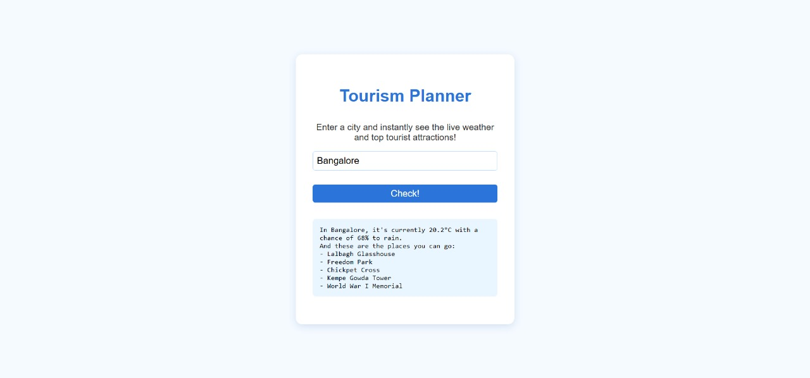
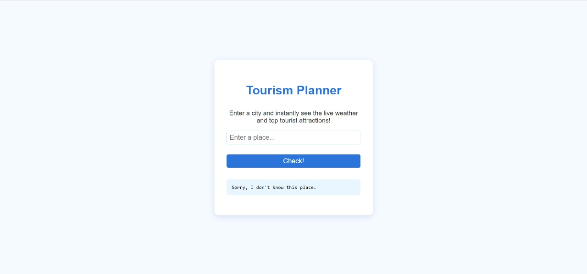

# Tourism Multi-Agent System

## Overview

A web-based tourism planner that connects users with live weather and top tourist attractions in any city. Powered by real-time public APIs and a modular backend agent architecture. Enter a city and instantly get travel info — easy and user-friendly!

---

## Features

- **Live weather:** See current temperature and rain chance for any city.
- **Top attractions:** Instantly get the top 5 tourist spots for your destination.
- **Beautiful UI:** Clean, responsive, centered, and modern layout.
- **Friendly errors:** Handles unknown locations and network issues gracefully.
- **Loading indicator:** Lets users know their query is being processed.
- **Keyboard shortcut:** Hit “Enter” or click the button—both work.

---

## Setup Instructions

### 1. Clone the repository
git clone https://github.com/Maithira/tourism-multiagent.git

### 2. Backend Setup
cd backend
pip install flask flask-cors requests
python app.py

The backend will start at `http://localhost:5000`

### 3. Frontend Setup

cd frontend
python -m http.server 8000
Then visit: `http://localhost:8000/index.html` in your browser.

---

## Usage

- Type a city name in the box.
- Hit “Enter” or click “Check!”
- View the weather and top attractions—live and up to date.

---

## Project Structure

```
tourism-multiagent/
├── backend/
│ ├── app.py
│ ├── utils.py
│ └── agents/
│ ├── weather_agent.py
│ └── places_agent.py
├── frontend/
│ ├── index.html
│ ├── app.js
│ ├── style.css
│ └── screenshots/
│ ├── landing.png
│ └── result.png
├── README.md
```

---

## APIs Used

- **Weather:** [Open-Meteo](https://open-meteo.com/)
- **Coordinates:** [Nominatim (OpenStreetMap)](https://nominatim.openstreetmap.org/)
- **Attractions:** [Overpass (OpenStreetMap)](https://overpass-api.de/)

---


## Screenshots

**Homepage**


**Example Search: Bangalore**


**Error: Place not found!**



---

## Why This Project Stands Out

- User-first, instant results for cities worldwide.
- Modular multi-agent backend — easy to extend.
- Clean, modern UI with quick, live feedback.
- Fully API-driven for real-world usefulness.

---

